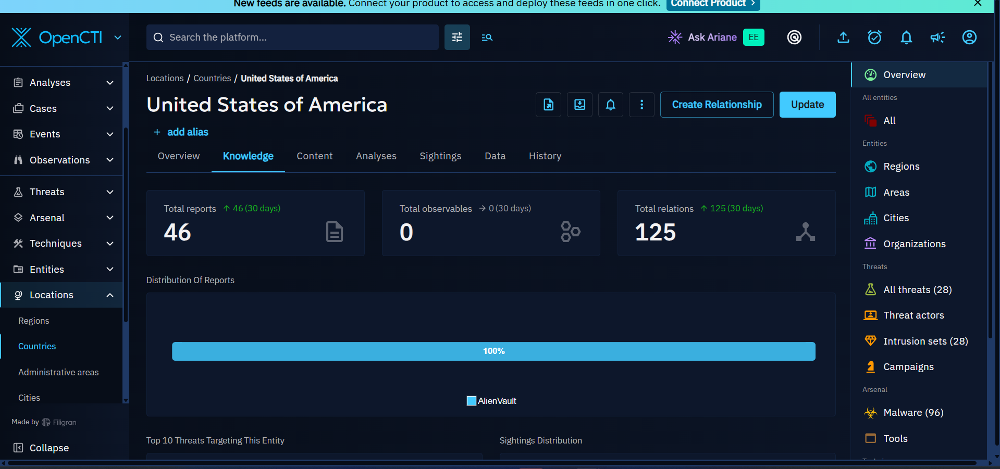
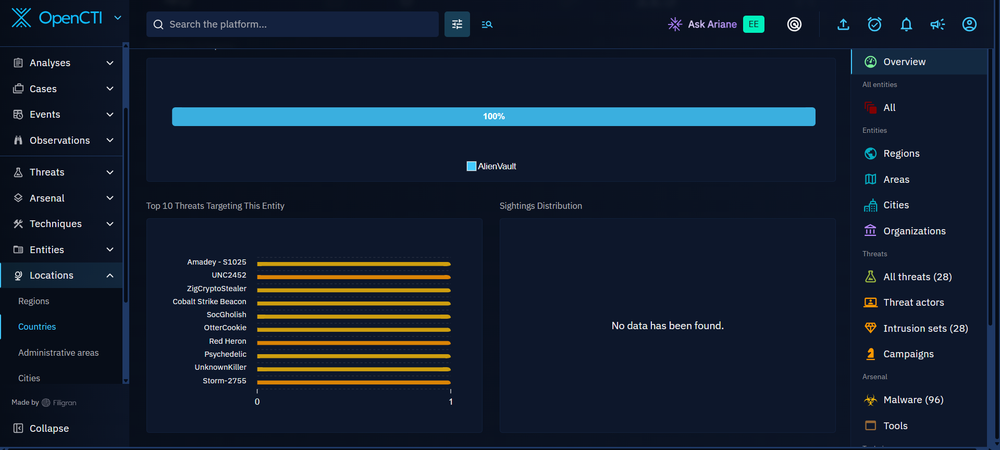

# Country-Level Threat Landscape

## National-Level Threat Assessment

OpenCTI was used as the primary threat intelligence platform for the national-level threat assessment.

The assessment was narrowed to the country where Fadurel Technology's headquarters is located. Fadurel Technology is headquartered in the **United States of America**, so the United States was selected as the country of focus for this investigation.

The purpose of this stage was to assess the threat landscape associated with the United States and identify threats that were relevant for further investigation.

OpenCTI was used to examine the threats associated with the selected country and provide a broader view of the observed threat landscape.

*Figure 1: United States of America selected as the country of focus in OpenCTI.*

---

## United States Threat Landscape

After selecting the United States in OpenCTI, the platform returned a set of threats associated with the selected country.

The following threats were observed during the investigation:

| Rank | Threat |
|---:|---|
| 1 | Amadey - S1025 |
| 2 | UNC2452 |
| 3 | ZigCryptoStealer |
| 4 | Cobalt Strike Beacon |
| 5 | SocGholish |
| 6 | OtterCookie |
| 7 | Red Heron |
| 8 | Psychedelic |
| 9 | UnknownKiller |
| 10 | Storm-2755 |

*Figure 2: Top 10 threats targeting the selected United States entity as displayed in OpenCTI.*

The OpenCTI country view also displayed **46 reports**, **125 relationships**, and **0 observables** within the displayed 30-day knowledge view at the time of the investigation.

These results provided a broader view of the threats associated with the United States within the OpenCTI dataset used for this investigation.

---

## Selection of the Two Threats

Based on the OpenCTI threat landscape observed during this investigation, **Amadey (S1025)** and **UNC2452** were selected for deeper analysis.

The selection was based on their position in the OpenCTI results and the availability of associated intelligence that could be examined further, including:

- Threat behaviour
- Associated indicators
- Campaigns
- Threat groups
- Malware and other related entities
- Attack patterns and techniques
- Relationships between the different intelligence objects

These two threats were therefore carried forward into the next stage of the investigation for more detailed technical and contextual analysis.

---

## Assessment Scope

The country-level assessment was used as the starting point for the deeper investigation.

The investigation then moved from the broader national threat landscape into individual threat analysis, where the selected threats could be examined in greater detail.

The next stage focuses on **Amadey** and **UNC2452**, including their behaviour, associated intelligence, indicators, campaigns, groups, and relationships available within OpenCTI.
