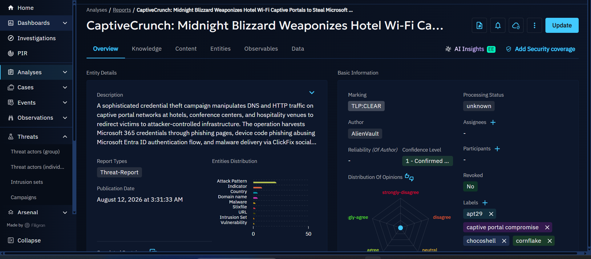
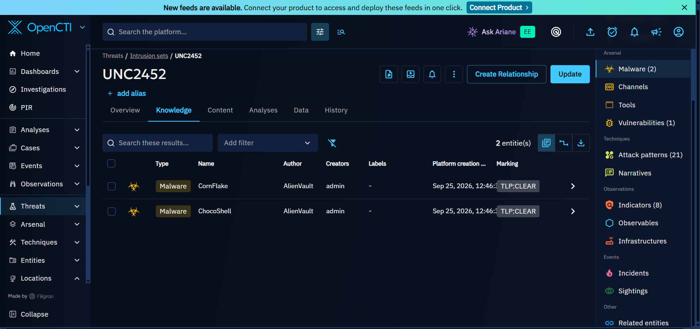
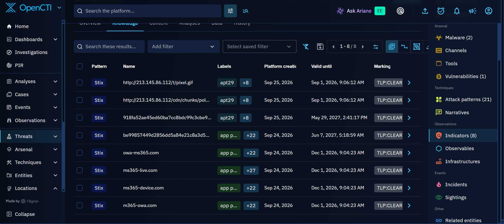
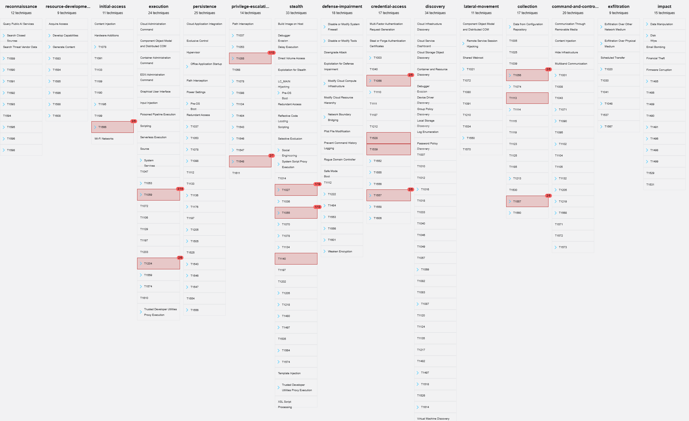

# UNC2452

## Threat Overview

UNC2452 is a threat actor identified in the OpenCTI investigation.

The OpenCTI data links UNC2452 to activity involving the **CaptiveCrunch** campaign.

The focus of this threat is to gain access to victims through compromised or manipulated infrastructure, steal login credentials, gain access to accounts, potentially steal information, and maintain access.

Fadurel Technologies provides e-commerce websites, cloud computing services and other technology services. The organization handles customer data and information, which means unauthorized access to accounts or systems could create a security risk.

---

## CaptiveCrunch Campaign

CaptiveCrunch is a campaign associated with the UNC2452 threat actor in the OpenCTI investigation.

The campaign is described as a sophisticated credential-theft campaign that manipulates **DNS and HTTP traffic** on captive portal networks at hotels, conference centers and hospitality venues.

The campaign redirects victims to attacker-controlled infrastructure.

The operation is described as harvesting **Microsoft 365 credentials** through phishing pages, abusing the **Microsoft Entra ID authentication flow**, and delivering malware through **ClickFix social engineering**.



*Figure 1: CaptiveCrunch campaign report displayed in OpenCTI.*

The OpenCTI report contains the following labels:

- `apt29`
- `captive portal compromise`
- `chocoshell`
- `cornflake`

The report was authored by **AlienVault** and has a publication date of **August 12, 2026**.

---

## Captive Portal Compromise

The campaign targets captive portal networks at locations such as:

- Hotels
- Conference centers
- Hospitality venues

The campaign manipulates DNS and HTTP traffic on these networks to redirect victims to attacker-controlled infrastructure.

This means that the attack does not rely only on sending a traditional phishing email to the victim. The network environment itself can be used as part of the attack.

The objective is to place the victim in a position where they interact with attacker-controlled content.

---

## Credential Theft

The campaign targets **Microsoft 365 credentials**.

According to the OpenCTI report, the operation uses phishing pages and abuses the Microsoft Entra ID authentication flow.

The objective is to obtain authentication information that can potentially provide the attacker with access to the victim's account.

This creates a significant risk because compromised credentials may allow an attacker to access information or maintain unauthorized access to an account.

---

## Social Engineering and ClickFix

The campaign also involves **ClickFix social engineering** for malware delivery.

ClickFix is used as part of the social-engineering process to persuade the victim to perform an action that assists the malware delivery process.

The OpenCTI report specifically identifies ClickFix social engineering as part of the malware delivery activity associated with CaptiveCrunch.

---

## Malware Associated With the Campaign

The OpenCTI investigation shows two malware entities associated with UNC2452:

- **CornFlake**
- **ChocoShell**



*Figure 2: Malware entities associated with UNC2452 in OpenCTI.*

The CaptiveCrunch report also contains the labels `cornflake` and `chocoshell`.

The malware should be treated as separate intelligence entities from the threat actor. The OpenCTI relationship shows that these malware entities are associated with the investigated activity.

---

## Indicators

OpenCTI displayed **8 indicators** associated with the UNC2452 threat.



*Figure 3: Indicators associated with UNC2452 displayed in OpenCTI.*

The indicators displayed in the OpenCTI investigation included URLs, domains and hashes.

The visible indicators included:

| Indicator | Type / Format | Label |
|---|---|---|
| `http://213.145.86.112/t/pixel.gif` | URL | `apt29` |
| `http://213.145.86.112/cdn/chunks/pol...` | URL | `apt29` |
| `918fa52ae45ed60ba7cc8bdc99c3cbe9...` | Hash | `apt29` |
| `be99857449d2856dd5a84e21c8a3d5...` | Hash | `app p...` |
| `owa-ms365.com` | Domain | `app p...` |
| `ms365-live.com` | Domain | `app p...` |
| `ms365-device.com` | Domain | `app p...` |
| `m365-owa.com` | Domain | `app p...` |

> **Note:** Some indicator values and labels are truncated in the OpenCTI interface screenshots. The truncated values are therefore not expanded or guessed in this investigation.

The indicators displayed in OpenCTI can later be used as intelligence inputs for detection engineering.

For example, domains and URLs can be used for network-based detection, while hashes can be used for file-based detection where applicable.

---

## Threat Behaviour Observed

Based on the OpenCTI investigation, the observed behaviour associated with the campaign includes:

- Captive portal compromise
- DNS traffic manipulation
- HTTP traffic manipulation
- Redirection to attacker-controlled infrastructure
- Phishing
- Microsoft 365 credential theft
- Abuse of the Microsoft Entra ID authentication flow
- ClickFix social engineering
- Malware delivery

The activity demonstrates how network infrastructure, social engineering, credential theft and malware delivery can be combined within the same campaign.

---

## Relationship Between the Threat, Campaign and Malware

The OpenCTI investigation shows relationships between the different intelligence entities.

```text
UNC2452
   |
   +--------------------+
   |                    |
   v                    v
CaptiveCrunch        Malware
Campaign             |
   |                 +---- CornFlake
   |                 |
   |                 +---- ChocoShell
   |
   +---- Captive Portal Compromise
   |
   +---- DNS/HTTP Traffic Manipulation
   |
   +---- Microsoft 365 Credential Theft
   |
   +---- Entra ID Authentication Abuse
   |
   +---- ClickFix Social Engineering
   |
   +---- Malware Delivery
   |
   +---- 8 Indicators
```


# MITRE ATT&CK Mapping

This section will map the observed UNC2452 behaviour to the relevant MITRE ATT&CK techniques and sub-techniques.

The mapping will connect the behaviours identified during the investigation to the corresponding MITRE ATT&CK attack patterns.

## MITRE ATT&CK Mapping

### UNC2452 - MITRE ATT&CK Relationship Mapping

#### ATT&CK Relationship Overview

OpenCTI associates UNC2452 with a broad range of MITRE ATT&CK attack patterns across multiple stages of the adversary lifecycle.

The OpenCTI knowledge view displayed attack patterns across:

- Stealth
- Privilege Escalation
- Collection
- Execution
- Credential Access
- Initial Access

The relationships displayed in OpenCTI were reviewed and mapped below.

> **Important:** An OpenCTI relationship indicates that the attack pattern is associated with the UNC2452 knowledge object. It should not automatically be interpreted as proof that every technique was used in every UNC2452 campaign. Campaign-specific claims require supporting evidence.

---

## Relationship Map

| Tactic shown in OpenCTI | ATT&CK ID | Attack Pattern | What the relationship means |
|---|---|---|---|
| Stealth | T1027 | Obfuscated Files or Information | Obfuscating files, code or other information to make analysis and detection more difficult. |
| Privilege Escalation | T1055 | Process Injection | Injecting code into another process to execute malicious code and potentially evade defenses or elevate privileges. |
| Collection | T1056 | Input Capture | Capturing user input that may contain credentials or other information. |
| Collection | T1056.001 | Input Capture: Keylogging | Capturing keystrokes from a victim system. |
| Execution | T1059 | Command and Scripting Interpreter | Using command or scripting interpreters to execute commands, scripts or binaries. |
| Execution | T1059.001 | PowerShell | Using PowerShell to execute commands or scripts. |
| Execution | T1059.003 | Windows Command Shell | Using the Windows Command Shell to execute commands or scripts. |
| Collection | T1113 | Screen Capture | Capturing screenshots of a victim's screen. |
| Stealth | T1140 | Deobfuscate/Decode Files or Information | Decoding or decrypting information that was previously obfuscated or encrypted. |
| Execution | T1204 | User Execution | Relying on the victim to perform an action that causes malicious activity to execute. |
| Execution | T1204.003 | User Execution: Malicious File | Relying on the victim to open or execute a malicious file. |
| Credential Access | T1528 | Steal Application Access Token | Stealing application access tokens that can be used to access resources as a legitimate user or application. |
| Credential Access | T1539 | Steal Web Session Cookie | Stealing authenticated web-session cookies for reuse in accessing web applications. |
| Privilege Escalation | T1548 | Abuse Elevation Control Mechanism | Circumventing mechanisms designed to control privilege elevation. |
| Privilege Escalation | T1548.002 | Abuse Elevation Control Mechanism: Bypass User Account Control | Bypassing Windows User Account Control to execute with elevated privileges. |
| Collection | T1557 | Adversary-in-the-Middle | Positioning between networked devices to support activities such as credential theft, network sniffing or traffic manipulation. |
| Collection | T1557.002 | Adversary-in-the-Middle: ARP Cache Poisoning | Manipulating ARP cache information to position the adversary between networked systems. |
| — | T1562 | Impair Defenses | Attempting to weaken or interfere with security controls and defensive mechanisms. |
| — | T1562.001 | Impair Defenses: Disable or Modify Tools | Disabling or modifying security tools or their configurations to reduce defensive visibility or protection. |
| Initial Access | T1566 | Phishing | Using phishing techniques to gain access to victim systems. |
| Initial Access | T1566.002 | Phishing: Spearphishing Link | Using malicious links to direct victims toward attacker-controlled content or resources. |

---

## UNC2452 MITRE ATT&CK Relationship Map

The OpenCTI knowledge view shows relationships between UNC2452 and the identified MITRE ATT&CK attack patterns.



*Figure: MITRE ATT&CK attack patterns associated with UNC2452 as displayed in OpenCTI.*

The relationship map demonstrates that the UNC2452 knowledge object is associated with techniques covering execution, privilege escalation, credential access, collection, stealth and initial access.

These relationships provide a broader behavioural profile of the threat actor.

They do not establish that all 21 attack patterns occurred together during the CaptiveCrunch campaign.

---

# Campaign Attack Pattern Mapping

The following attack patterns will be assessed separately against the **CaptiveCrunch** campaign.

The campaign-specific mapping is intended to identify techniques that are supported by the evidence collected during the investigation rather than assuming that every technique associated with UNC2452 was used in the campaign.

| Attack Stage | MITRE ATT&CK ID | Attack Pattern | Relationship to Observed Campaign |
|---|---|---|---|
| Network Positioning | T1557 | Adversary-in-the-Middle | The CaptiveCrunch report describes manipulation of DNS and HTTP traffic on captive portal networks. |
| User Interaction | T1204 | User Execution | The campaign uses social engineering to influence victim actions. |
| User Interaction | T1204.003 | User Execution: Malicious File | To be confirmed from the underlying campaign evidence before being treated as a specific technique. |
| Credential Access | T1528 | Steal Application Access Token | The campaign abuses the Microsoft Entra ID authentication flow; the exact token-theft mechanism should be confirmed from the underlying report. |
| Credential Access | T1539 | Steal Web Session Cookie | To be confirmed from the underlying campaign evidence. |
| Initial Access | T1566 | Phishing | The CaptiveCrunch report describes phishing pages used to harvest Microsoft 365 credentials. |
| Initial Access | T1566.002 | Phishing: Spearphishing Link | To be confirmed if the underlying campaign evidence establishes delivery through a malicious link. |

> **Important:** Campaign-specific ATT&CK mappings should only be retained where the underlying CaptiveCrunch evidence supports the technique. The broader UNC2452 relationship map should not be used as evidence that every technique occurred during CaptiveCrunch.

---

## CaptiveCrunch ATT&CK Flow

The observed campaign can be represented as:

```text
UNC2452
    |
    ↓
CaptiveCrunch Campaign
    |
    ↓
Captive Portal Network
    |
    ↓
DNS / HTTP Traffic Manipulation
    |
    ↓
Victim Redirection
    |
    ↓
Phishing / Social Engineering
    |
    +----------------------+
    |                      |
    ↓                      ↓
Credential Theft      ClickFix /
                      Malware Delivery
    |                      |
    +----------+-----------+
               |
               ↓
        Potential Compromise
               |
               ↓
          Further Access
