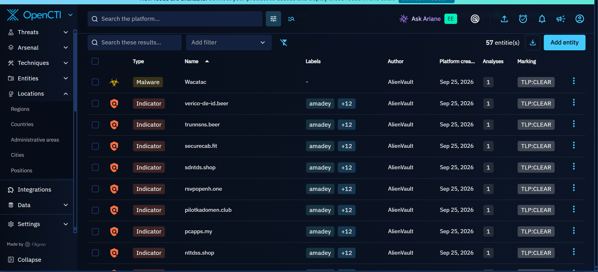

# Amadey Threat Analysis
### Amadey and the Campaign

Amadey appears in OpenCTI as a **malware entity** and is linked to the **"Disposable Domains, Durable Hosting"** campaign.

However, the campaign does not clearly state that Amadey was the malware used in the attack. The campaign describes activities such as **remote access, persistence, and the use of stealers**, with several malware entities linked to the campaign.

Therefore, the behaviour and attack patterns below are based on what OpenCTI associates with Amadey through this campaign. They should not be taken as proof that **Amadey itself was the payload used in the attack**.

## 1. Threat Overview

**Amadey (S1025)** was identified as the first threat in the United States threat landscape displayed in OpenCTI during this investigation.

Amadey is a malware entity represented in OpenCTI with associated indicators, reports, malware relationships, and other intelligence that can be used to understand its activity.

The investigation focused on the available intelligence associated with Amadey and a related report titled **"Disposable Domains, Durable Hosting"**, which provided additional context about the infrastructure and attack activity associated with the observed threat.

*Figure: Amadey-related intelligence displayed in OpenCTI.*

---

## 2. Amadey Indicators

OpenCTI contained multiple indicators associated with the Amadey investigation. These indicators included different types of observables associated with the infrastructure and activity surrounding the malware.

The available intelligence included domains, IP addresses, and other malware-related indicators that could be investigated through OpenCTI.

*Figure: Indicators associated with Amadey in OpenCTI.*

Individual indicators could also be selected in OpenCTI to examine additional information and relationships connected to them.

*Figure: Detailed information for an Amadey-associated indicator.*

---

## 3. Amadey Malware and Associated Activity

The OpenCTI investigation also provided malware-related intelligence associated with the Amadey investigation.

This allowed the investigation to move beyond the Amadey malware entity itself and examine other malware relationships represented within the available threat intelligence.

*Figure: Malware-related intelligence associated with the Amadey investigation.*

These relationships provide additional context around the malware ecosystem and activity represented within the OpenCTI dataset.

---

## 4. Related Reports and Intelligence

OpenCTI contained multiple reports and analyses related to Amadey.

The related intelligence included:

- **Disposable Domains, Durable Hosting**
- **VectraRAT: An Undocumented Full-Stack MaaS**
- **Operation STANDOFF: A Campaign Hiding C2**
- **StealC and Amadey: Breaking Down Infostealers**

These reports provided additional information that could be used to understand the infrastructure, delivery methods, malware relationships, and activity associated with the investigation.

*Figure: Reports and analyses related to Amadey in OpenCTI.*

For this investigation, **"Disposable Domains, Durable Hosting"** was selected for deeper analysis because it provided detailed information about the infrastructure and attack activity associated with the observed activity.

---

## 5. Disposable Domains, Durable Hosting

### 5.1 Campaign Overview

The **"Disposable Domains, Durable Hosting"** report describes multiple malicious activity chains observed over a period of approximately five months.

The activity involved the use of a common infrastructure provider identified as **AS202412 / OMEGATECH LTD**, registered in Seychelles.

The activity showed the use of disposable domains and changing infrastructure while maintaining a relationship with the same hosting infrastructure.

*Figure: "Disposable Domains, Durable Hosting" report investigated through OpenCTI.*

---

### 5.2 Initial Access and Social Engineering

The observed activity used **fake CAPTCHA pages** as part of the initial interaction with victims.

The fake CAPTCHA pages used a technique known as **ClickFix**, where the victim is instructed to perform an action presented as necessary to verify that they are human.

Instead of performing a legitimate verification process, the victim is manipulated into copying and executing a command.

The command is then executed through the Windows Run interface, allowing the malicious activity to continue on the victim's system.

This makes the user an important part of the attack chain because successful execution depends on convincing the victim to follow the instructions presented by the fake CAPTCHA.

---

### 5.3 Infrastructure and Disposable Domains

One of the notable characteristics of the activity was the use of **disposable domains**.

The infrastructure used multiple domains during the observed activity, allowing the operators to change domains while maintaining elements of their underlying infrastructure.

The investigation also identified the use of compromised legitimate websites and other hosting or staging mechanisms as part of the activity.

The report showed that different activity chains used different staging and delivery mechanisms, including:

- Cloud storage
- Disposable domains
- Compromised legitimate websites
- Trojanized installers
- Blockchain-resolved command-and-control infrastructure

Although the delivery and staging methods differed between activity chains, they shared infrastructure associated with **AS202412** during the observed period.

---

### 5.4 Expansion of Infrastructure

The infrastructure associated with the activity was not limited to a single network range.

The observed provider expanded its infrastructure to include multiple **/24 prefixes** during the period covered by the report.

This demonstrates how the infrastructure could change and expand while maintaining relationships with the same hosting provider.

The use of disposable domains combined with changing infrastructure makes individual indicators more likely to become obsolete over time.

This is important when investigating the activity because focusing on a single domain or IP address may not provide the full picture of the infrastructure.

---

### 5.5 Malware Delivery and Post-Execution Activity

The observed attack chains were associated with the delivery of different malware families, including information stealers and remote access trojans.

Where the victim successfully followed the instructions on the fake CAPTCHA page and executed the supplied command, the activity could progress from the initial social-engineering stage to malware execution.

The observed malware activity included the deployment of stealers and RATs.

The investigation notes also identified persistence mechanisms that allowed successful malware infections to survive system reboots.

This means that the attack was not limited to the initial execution of the malicious command. Successful compromise could continue through subsequent malware activity on the affected system.

---

### 5.6 Victim Interaction

An important observation from the report was that not every visitor to the malicious infrastructure necessarily resulted in a successful compromise.

Many visitors stopped at the initial lure page.

Successful compromise required the victim to interact with the fake CAPTCHA and follow the instructions provided by the attacker-controlled page.

This makes the social-engineering component an important part of the attack chain.

The activity can therefore be represented at a high level as:

Victim visits malicious page  
↓  
Fake CAPTCHA / ClickFix lure  
↓  
Victim is instructed to copy a command  
↓  
Command executed through Windows Run  
↓  
Malware delivery / execution  
↓  
Stealer or RAT activity  
↓  
Persistence and continued access

---

## 6. Campaign Attack Chain

Based on the intelligence examined during the investigation, the observed activity can be summarized into several stages.

### Stage 1: Initial Access

The victim encounters a malicious or compromised webpage containing a fake CAPTCHA.

### Stage 2: Social Engineering

The fake CAPTCHA uses ClickFix-style instructions to convince the victim to copy and execute a command.

### Stage 3: Command Execution

The victim executes the supplied command through the Windows Run interface.

### Stage 4: Payload Delivery

The command allows the attack chain to progress toward the delivery or execution of malicious payloads.

### Stage 5: Malware Execution

The resulting activity can involve information stealers or remote access trojans.

### Stage 6: Persistence

Successful malware execution can establish persistence, allowing the malicious activity to continue after a system reboot.

### Stage 7: Continued Activity

The compromised system can then become part of the subsequent malware activity associated with information theft or remote access.

---

## 7. Indicators Observed

The OpenCTI investigation produced multiple indicators associated with the Amadey-related intelligence.

Examples of the observed infrastructure included domains and IP addresses represented within OpenCTI.

The investigation notes included indicators such as:

- `verico-de-id.beer`
- `trunnsns.beer`
- `securecab.fit`
- `sdntds.shop`
- `rsvpopenh.one`
- `pilotkadomen.club`
- `pcapps.my`
- `nttdss.shop`
- `kerosand.net`
- `idverification-code.beer`
- `id-verif-code.info`
- `approvalrequest-api.com`
- `gettrack.my`
- `fraudtechnology.com`

IP addresses observed in the investigation included:

- `193.202.84.17`
- `176.65.144.127`

These indicators were examined as part of the OpenCTI investigation and provide potential intelligence for understanding the infrastructure associated with the observed activity.

---

## 8. Infrastructure Relationship

A key observation from the investigation was that multiple malicious activity chains were connected through the same underlying infrastructure provider.

The activity should not be interpreted as meaning that every malicious domain existed on one physical server.

Instead, the evidence indicates that multiple domains and activity chains shared infrastructure associated with **AS202412 / OMEGATECH LTD**.

This distinction is important because a hosting provider or autonomous system can contain multiple servers, addresses, and domains.

The infrastructure relationship therefore provides a broader investigative pivot than examining an individual domain in isolation.

---

## 9. Related Malware and Activity

The OpenCTI relationships and associated reports provided additional context around malware observed in connection with the investigation.

The available intelligence linked the activity to information-stealing malware and remote access trojans.

The related reports also included intelligence on **StealC**, which was specifically discussed in the report **"StealC and Amadey: Breaking Down Infostealers."**

This relationship is useful because it demonstrates how OpenCTI can connect a malware entity to reports, indicators, infrastructure, and other malware-related intelligence.

---

# 10. MITRE ATT&CK Mapping

This section will map the observed Amadey behaviour to the relevant **MITRE ATT&CK techniques and sub-techniques**.

The mapping will connect the behaviours identified during the investigation to the corresponding MITRE ATT&CK attack patterns.

### MITRE ATT&CK Mapping

# Amadey - MITRE ATT&CK Relationship Mapping

## ATT&CK Relationship Overview

OpenCTI associates **Amadey - S1025** with a broad range of MITRE ATT&CK attack patterns across multiple stages of the adversary lifecycle.

The OpenCTI knowledge view displayed attack patterns across:

- Resource Development
- Initial Access
- Execution
- Persistence
- Privilege Escalation
- Stealth
- Defense Impairment
- Credential Access
- Discovery
- Lateral Movement
- Collection
- Command and Control
- Exfiltration
- Impact

The relationships displayed in OpenCTI were reviewed and mapped below.

> **Important:** An OpenCTI relationship indicates that the attack pattern is associated with the Amadey knowledge object. It should not automatically be interpreted as proof that every technique was used in every Amadey campaign. Campaign-specific claims require supporting evidence.

---

## Relationship Map

*Figure: MITRE ATT&CK attack patterns associated with Amadey - S1025 as displayed in OpenCTI.*
---

## Campaign Attack Pattern Mapping

The following attack patterns represent the attack chain associated with Amadey in the
**Disposable Domains, Durable Hosting** campaign.

The campaign used multiple malicious chains that shared associated infrastructure
linked to **AS202412**. The domains formed part of this malicious infrastructure
and were used to direct victims into the subsequent attack chain.

| Attack Stage | MITRE ATT&CK ID | Attack Pattern | Relationship to Observed Campaign |
|---|---|---|---|
| Infrastructure Acquisition | T1583.001 | Acquire Infrastructure: Domains | The campaign used disposable/malicious domains as part of the attacker-controlled infrastructure associated with AS202412. |
| Web Infrastructure | T1608.004 | Stage Capabilities: Drive-by Target | The attacker prepared malicious web resources through which victims were directed into the attack chain. |
| Initial Access / Victim Interaction | T1204.004 | User Execution: Malicious Copy and Paste | The fake CAPTCHA/ClickFix page instructed victims to copy and paste a malicious command. |
| Command and Control | T1568 | Dynamic Resolution | Attacker infrastructure was used to support the resolution or location of infrastructure associated with C2 activity. |
| Remote Access | T1219 | Remote Access Software | Remote-access capability was associated with the observed malware activity. |
| Persistence | T1547 | Boot or Logon Autostart Execution | The malware demonstrated persistence that allowed it to remain active after system restart. |
| Exfiltration | T1041 | Exfiltration Over C2 Channel | Relevant where collected information was transmitted through the C2 channel. |

                    AMADEY - S1025
                          |
                          ↓
          Disposable Domains, Durable Hosting
                          |
                          ↓
              Attacker Infrastructure
                          |
                          ↓
                     T1583.001
                 Acquire Infrastructure:
                       Domains
                          |
                          ↓
                 Malicious / Disposable
                       Domains
                          |
                          ↓
                     AS202412
             Associated Infrastructure
                          |
                          ↓
                  Victim visits page
                          |
                          ↓
                   Fake CAPTCHA
                     / ClickFix
                          |
                          ↓
                     T1204.004
             Malicious Copy and Paste
                          |
                          ↓
                 Victim executes command
                          |
                          ↓
                       Malware
                          |
                          ↓
                         C2
                          |
                          ↓
                 Persistence / Access
                          |
                          ↓
                    Exfiltration

# 11. Relevance of Amadey to Fadurel Technologies
# Amadey - Relevance to Fadurel Technologies

## Fadurel Technologies

Fadurel Technologies:

- Does online retail business.
- Has third-party sellers.
- Provides cloud computing.
- Does advertising.
- Owns a streaming platform.

---

## How Does Amadey Relate to Fadurel Technologies?

So, how does Amadey relate to Fadurel Technologies?

Or how can Amadey pose a threat to Fadurel Technologies?

It is established from the CTI analysis that **Amadey itself is a malware**.

Several campaigns are associated with Amadey.

---

## Infrastructure Associated with Amadey

The infrastructure associated with Amadey is **AS202412**.

If the infrastructure associated with Amadey manages to compromise Fadurel Technologies' endpoints that support its online portal business, this could be a major catastrophe.

Imagine Fadurel Technologies employees surfing the internet on company endpoints. While on a website that uses the **ClickFix technique** to deceive the employee, if the employee falls for the trap and runs the command as instructed by the CAPTCHA on their endpoint, the device could become compromised.

This could lead to endpoint compromise.

---

## Possible Attack Progression

The attacker might then try to download malware onto the endpoint after acquiring access.

Further remote access might occur.

Identity might be compromised.

Lateral movement might occur.

Exfiltration of confidential data might also occur.

---

## Potential Impact on Fadurel Technologies

So, this might result in:

- Lack of availability on Fadurel Technologies' endpoints if the malware spreads.
- Data exfiltration, which could compromise the confidentiality of customer data.
- Identity compromise if the attacker gains access to employees' login credentials.
- Fadurel Technologies' streaming platforms might become unavailable.
- The online website could become compromised.

---

## Attack Activity and Attacker Behaviour

The events describe each attack activity or attacker behaviour observed during the investigation.

The attack activity can therefore progress from the initial compromise of an endpoint to further access, identity compromise, lateral movement, and potential exfiltration of confidential data.

---
## Fadurel Technologies Threat Scenario

The potential scenario involving Fadurel Technologies can be summarized as:

    Fadurel Technologies Employee
                |
                v
         Internet Browsing
                |
                v
           Malicious Website
                |
                v
           ClickFix Technique
                |
                v
           Fake CAPTCHA
                |
                v
     Employee Runs the Command
                |
                v
         Endpoint Compromise
                |
                v
          Malware Download
                |
                v
           Further Access
                |
          +-----+-----+
          |           |
          v           v
       Identity    Remote
      Compromise   Access
          |           |
          +-----+-----+
                |
                v
          Lateral Movement
                |
                v
         Data Exfiltration
                |
                v
      Confidential Data
          Compromise

 ## 12. Investigation Summary

This investigation was conducted to assess the cyber threat landscape associated with the country where **Fadurel Technologies** is headquartered and to identify threats requiring deeper analysis.

Fadurel Technologies operates in the technology sector, with activities including online retail, third-party sellers, cloud computing, advertising, and streaming services. The organization's headquarters is located in the **United States of America**.

**OpenCTI** was used as the primary threat intelligence platform, with intelligence from **AlienVault OTX** and **MITRE ATT&CK** used to support the investigation.

The United States was selected as the country of focus in OpenCTI. The resulting threat landscape identified **Amadey - S1025** and **UNC2452** as the first two threats displayed in the OpenCTI results and therefore selected for further investigation.

The investigation then focused on **Amadey - S1025** and examined its associated reports, campaigns, indicators, malware relationships, infrastructure, and MITRE ATT&CK attack patterns.

One of the campaigns investigated was **Disposable Domains, Durable Hosting**. The campaign involved multiple malicious chains that shared associated infrastructure linked to **AS202412**. The activity included malicious and disposable domains, fake CAPTCHA pages, and the **ClickFix** technique, in which victims were instructed to copy and paste commands.

The investigation mapped the observed campaign activity to relevant MITRE ATT&CK attack patterns, including infrastructure acquisition, web infrastructure staging, malicious copy-and-paste execution, dynamic resolution, remote-access activity, persistence, and potential exfiltration.

OpenCTI also showed a broader set of MITRE ATT&CK relationships associated with Amadey. These relationships were documented separately from the campaign-specific mapping to distinguish the broader Amadey threat profile from the techniques specifically associated with the investigated campaign.

The investigation also assessed the potential relevance of Amadey to Fadurel Technologies. A successful compromise of an employee endpoint through a ClickFix-style attack could potentially lead to further malware activity, remote access, identity compromise, lateral movement, and exfiltration of confidential information.

Potential consequences identified for Fadurel Technologies include endpoint availability issues, compromise of customer data confidentiality, identity compromise, disruption of streaming services, and compromise of online business infrastructure.

Overall, the investigation established a relationship between **Amadey, its associated infrastructure, the Disposable Domains, Durable Hosting campaign, its indicators and malware relationships, and relevant MITRE ATT&CK attack patterns**, while also assessing how the observed activity could potentially affect Fadurel Technologies.

