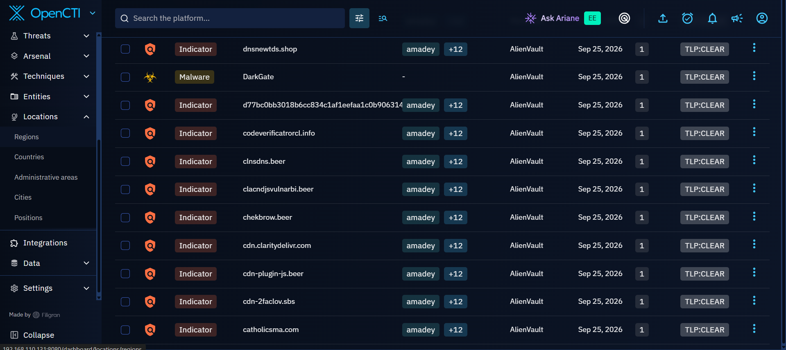
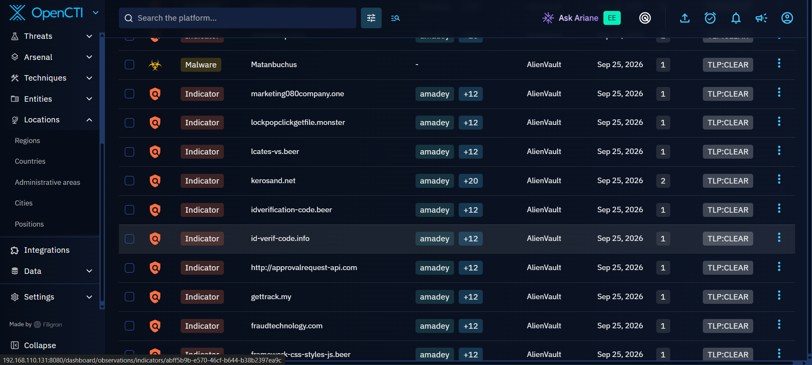
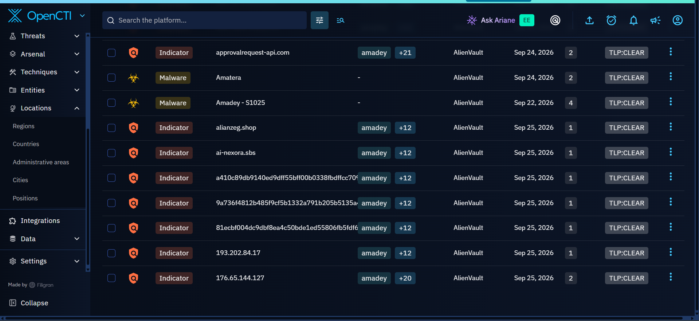
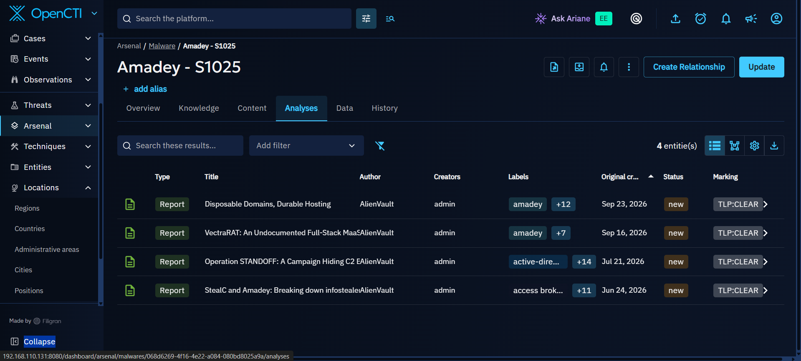
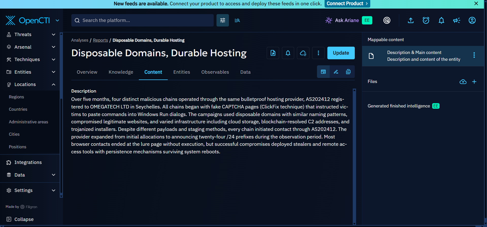
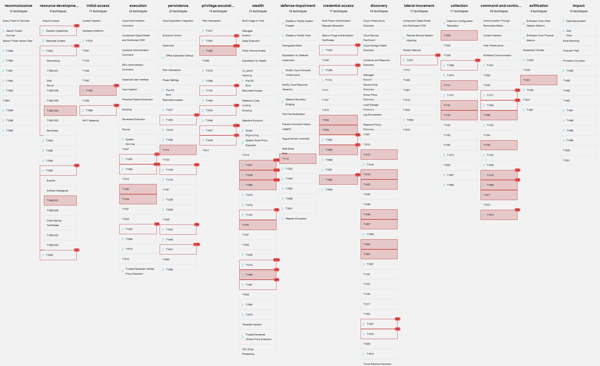

# Amadey Threat Analysis

## 1. Threat Overview

**Amadey (S1025)** was identified as the first-ranked threat in the United States threat landscape displayed in OpenCTI during this investigation.

Amadey is a malware entity represented in OpenCTI with associated indicators, reports, malware relationships, and other intelligence that can be used to understand its activity.

The investigation focused on the available intelligence associated with Amadey and a related report titled **"Disposable Domains, Durable Hosting"**, which provided additional context about the infrastructure and attack activity associated with the observed threat.

*Figure: Amadey-related intelligence displayed in OpenCTI.*

---

## 2. Amadey Indicators

OpenCTI contained multiple indicators associated with the Amadey investigation. These indicators included different types of observables associated with the infrastructure and activity surrounding the malware.

The available intelligence included domains, IP addresses, and other malware-related indicators that could be investigated through OpenCTI.

*Figure: Indicators associated with Amadey in OpenCTI.*

Individual indicators could also be selected in OpenCTI to examine additional information and relationships connected to them.

*Figure: Detailed information for an Amadey-associated indicator.*

---

## 3. Amadey Malware and Associated Activity

The OpenCTI investigation also provided malware-related intelligence associated with the Amadey investigation.

This allowed the investigation to move beyond the Amadey malware entity itself and examine other malware relationships represented within the available threat intelligence.

*Figure: Malware-related intelligence associated with the Amadey investigation.*

These relationships provide additional context around the malware ecosystem and activity represented within the OpenCTI dataset.

---

## 4. Related Reports and Intelligence

OpenCTI contained multiple reports and analyses related to Amadey.

The related intelligence included:

- **Disposable Domains, Durable Hosting**
- **VectraRAT: An Undocumented Full-Stack MaaS**
- **Operation STANDOFF: A Campaign Hiding C2**
- **StealC and Amadey: Breaking Down Infostealers**

These reports provided additional information that could be used to understand the infrastructure, delivery methods, malware relationships, and activity associated with the investigation.

*Figure: Reports and analyses related to Amadey in OpenCTI.*

For this investigation, **"Disposable Domains, Durable Hosting"** was selected for deeper analysis because it provided detailed information about the infrastructure and attack activity associated with the observed activity.

---

## 5. Disposable Domains, Durable Hosting

### 5.1 Campaign Overview

The **"Disposable Domains, Durable Hosting"** report describes multiple malicious activity chains observed over a period of approximately five months.

The activity involved the use of a common infrastructure provider identified as **AS202412 / OMEGATECH LTD**, registered in Seychelles.

The activity showed the use of disposable domains and changing infrastructure while maintaining a relationship with the same hosting infrastructure.

*Figure: "Disposable Domains, Durable Hosting" report investigated through OpenCTI.*

---

### 5.2 Initial Access and Social Engineering

The observed activity used **fake CAPTCHA pages** as part of the initial interaction with victims.

The fake CAPTCHA pages used a technique known as **ClickFix**, where the victim is instructed to perform an action presented as necessary to verify that they are human.

Instead of performing a legitimate verification process, the victim is manipulated into copying and executing a command.

The command is then executed through the Windows Run interface, allowing the malicious activity to continue on the victim's system.

This makes the user an important part of the attack chain because successful execution depends on convincing the victim to follow the instructions presented by the fake CAPTCHA.

---

### 5.3 Infrastructure and Disposable Domains

One of the notable characteristics of the activity was the use of **disposable domains**.

The infrastructure used multiple domains during the observed activity, allowing the operators to change domains while maintaining elements of their underlying infrastructure.

The investigation also identified the use of compromised legitimate websites and other hosting or staging mechanisms as part of the activity.

The report showed that different activity chains used different staging and delivery mechanisms, including:

- Cloud storage
- Disposable domains
- Compromised legitimate websites
- Trojanized installers
- Blockchain-resolved command-and-control infrastructure

Although the delivery and staging methods differed between activity chains, they shared infrastructure associated with **AS202412** during the observed period.

---

### 5.4 Expansion of Infrastructure

The infrastructure associated with the activity was not limited to a single network range.

The observed provider expanded its infrastructure to include multiple **/24 prefixes** during the period covered by the report.

This demonstrates how the infrastructure could change and expand while maintaining relationships with the same hosting provider.

The use of disposable domains combined with changing infrastructure makes individual indicators more likely to become obsolete over time.

This is important when investigating the activity because focusing on a single domain or IP address may not provide the full picture of the infrastructure.

---

### 5.5 Malware Delivery and Post-Execution Activity

The observed attack chains were associated with the delivery of different malware families, including information stealers and remote access trojans.

Where the victim successfully followed the instructions on the fake CAPTCHA page and executed the supplied command, the activity could progress from the initial social-engineering stage to malware execution.

The observed malware activity included the deployment of stealers and RATs.

The investigation notes also identified persistence mechanisms that allowed successful malware infections to survive system reboots.

This means that the attack was not limited to the initial execution of the malicious command. Successful compromise could continue through subsequent malware activity on the affected system.

---

### 5.6 Victim Interaction

An important observation from the report was that not every visitor to the malicious infrastructure necessarily resulted in a successful compromise.

Many visitors stopped at the initial lure page.

Successful compromise required the victim to interact with the fake CAPTCHA and follow the instructions provided by the attacker-controlled page.

This makes the social-engineering component an important part of the attack chain.

The activity can therefore be represented at a high level as:

Victim visits malicious page  
↓  
Fake CAPTCHA / ClickFix lure  
↓  
Victim is instructed to copy a command  
↓  
Command executed through Windows Run  
↓  
Malware delivery / execution  
↓  
Stealer or RAT activity  
↓  
Persistence and continued access

---

## 6. Amadey Attack Chain

Based on the intelligence examined during the investigation, the observed activity can be summarized into several stages.

### Stage 1: Initial Access

The victim encounters a malicious or compromised webpage containing a fake CAPTCHA.

### Stage 2: Social Engineering

The fake CAPTCHA uses ClickFix-style instructions to convince the victim to copy and execute a command.

### Stage 3: Command Execution

The victim executes the supplied command through the Windows Run interface.

### Stage 4: Payload Delivery

The command allows the attack chain to progress toward the delivery or execution of malicious payloads.

### Stage 5: Malware Execution

The resulting activity can involve information stealers or remote access trojans.

### Stage 6: Persistence

Successful malware execution can establish persistence, allowing the malicious activity to continue after a system reboot.

### Stage 7: Continued Activity

The compromised system can then become part of the subsequent malware activity associated with information theft or remote access.

---

## 7. Indicators Observed

The OpenCTI investigation produced multiple indicators associated with the Amadey-related intelligence.

Examples of the observed infrastructure included domains and IP addresses represented within OpenCTI.

The investigation notes included indicators such as:

- `verico-de-id.beer`
- `trunnsns.beer`
- `securecab.fit`
- `sdntds.shop`
- `rsvpopenh.one`
- `pilotkadomen.club`
- `pcapps.my`
- `nttdss.shop`
- `kerosand.net`
- `idverification-code.beer`
- `id-verif-code.info`
- `approvalrequest-api.com`
- `gettrack.my`
- `fraudtechnology.com`

IP addresses observed in the investigation included:

- `193.202.84.17`
- `176.65.144.127`

These indicators were examined as part of the OpenCTI investigation and provide potential intelligence for understanding the infrastructure associated with the observed activity.

---

## 8. Infrastructure Relationship

A key observation from the investigation was that multiple malicious activity chains were connected through the same underlying infrastructure provider.

The activity should not be interpreted as meaning that every malicious domain existed on one physical server.

Instead, the evidence indicates that multiple domains and activity chains shared infrastructure associated with **AS202412 / OMEGATECH LTD**.

This distinction is important because a hosting provider or autonomous system can contain multiple servers, addresses, and domains.

The infrastructure relationship therefore provides a broader investigative pivot than examining an individual domain in isolation.

---

## 9. Related Malware and Activity

The OpenCTI relationships and associated reports provided additional context around malware observed in connection with the investigation.

The available intelligence linked the activity to information-stealing malware and remote access trojans.

The related reports also included intelligence on **StealC**, which was specifically discussed in the report **"StealC and Amadey: Breaking Down Infostealers."**

This relationship is useful because it demonstrates how OpenCTI can connect a malware entity to reports, indicators, infrastructure, and other malware-related intelligence.

---

# 10. MITRE ATT&CK Mapping

This section will map the observed Amadey behaviour to the relevant **MITRE ATT&CK techniques and sub-techniques**.

The mapping will connect the behaviours identified during the investigation to the corresponding MITRE ATT&CK attack patterns.

### MITRE ATT&CK Mapping

# Amadey - MITRE ATT&CK Relationship Mapping

## ATT&CK Relationship Overview

OpenCTI associates **Amadey - S1025** with a broad range of MITRE ATT&CK attack patterns across multiple stages of the adversary lifecycle.

The OpenCTI knowledge view displayed attack patterns across:

- Resource Development
- Initial Access
- Execution
- Persistence
- Privilege Escalation
- Stealth
- Defense Impairment
- Credential Access
- Discovery
- Lateral Movement
- Collection
- Command and Control
- Exfiltration
- Impact

The relationships displayed in OpenCTI were reviewed and mapped below.

> **Important:** An OpenCTI relationship indicates that the attack pattern is associated with the Amadey knowledge object. It should not automatically be interpreted as proof that every technique was used in every Amadey campaign. Campaign-specific claims require supporting evidence.

---

## Relationship Map

| Tactic shown in OpenCTI | ATT&CK ID | Attack Pattern | What the relationship means |
|---|---|---|---|
| Resource Development | T1583 | Acquire Infrastructure | Obtaining infrastructure that can support malicious operations. |
| Resource Development | T1583.004 | Acquire Infrastructure: Server | Obtaining or renting servers for activities such as hosting, staging or C2. |
| Resource Development | T1588 | Obtain Capabilities | Obtaining capabilities needed for an operation rather than developing everything internally. |
| Resource Development | T1588.001 | Obtain Capabilities: Malware | Obtaining malware as a capability that can be used during an operation. |
| Resource Development | T1608 | Stage Capabilities | Preparing or placing capabilities on infrastructure so they can later be used against targets. |
| Initial Access | T1185 | Browser Session Hijacking | Abusing a browser session to intercept or inherit authenticated browser information such as cookies or sessions. |
| Initial Access | T1506 | Web Session Cookie | Using stolen web-session cookies to authenticate to web applications without repeating the normal authentication process. |
| Execution | T1053 | Scheduled Task/Job | Using scheduled tasks or jobs to execute malicious code at a particular time or repeatedly. |
| Execution | T1059 | Command and Scripting Interpreter | Using command shells or scripting interpreters to execute commands or scripts. |
| Execution | T1106 | Native API | Using operating-system APIs to perform actions such as creating processes or gathering information. |
| Execution | T1129 | Shared Modules | Executing code by loading shared modules such as DLLs or shared objects. |
| Execution | T1204 | User Execution | Relying on the victim to perform an action that causes malicious activity to execute. |
| Persistence | T1053 | Scheduled Task/Job | Using scheduled execution to maintain recurring or persistent execution. |
| Persistence | T1112 | Modify Registry | Modifying Windows Registry settings to support persistence, execution, configuration changes or defense evasion. |
| Persistence | T1136 | Create Account | Creating an account that can provide continued access to a system or environment. |
| Persistence | T1543 | Create or Modify System Process | Creating or modifying services, daemons or other system processes for persistent execution. |
| Persistence | T1547 | Boot or Logon Autostart Execution | Configuring a system so malicious code automatically executes during boot or user logon. |
| Privilege Escalation | T1037 | Boot or Logon Initialization Scripts | Using scripts that execute during system boot or logon, potentially providing persistence or elevated execution. |
| Privilege Escalation | T1053 | Scheduled Task/Job | Abusing scheduled execution to run code under a more privileged context. |
| Privilege Escalation | T1055 | Process Injection | Injecting malicious code into another process, potentially hiding execution or obtaining access to another process context. |
| Privilege Escalation | T1134 | Access Token Manipulation | Manipulating access tokens to operate under another security context or obtain additional privileges. |
| Privilege Escalation | T1543 | Create or Modify System Process | Creating or modifying system services/processes that may execute with elevated privileges. |
| Privilege Escalation | T1547 | Boot or Logon Autostart Execution | Abusing autostart mechanisms that may execute with higher privileges. |
| Stealth | T1027 | Obfuscated Files or Information | Obfuscating code, strings, files or other information to make analysis and detection more difficult. |
| Stealth | T1036 | Masquerading | Making malicious files, processes or other objects appear legitimate. |
| Stealth | T1055 | Process Injection | Hiding malicious execution inside another process. |
| Stealth | T1134 | Access Token Manipulation | Manipulating security tokens to change the security context under which activity runs. |
| Stealth | T1140 | Deobfuscate/Decode Files or Information | Decoding or decrypting information that was previously obfuscated. |
| Stealth | T1218 | System Binary Proxy Execution | Abusing trusted system binaries to execute malicious code. |
| Stealth | T1480 | Execution Guardrails | Using environmental conditions to determine whether malicious activity should execute. |
| Stealth | T1497 | Virtualization/Sandbox Evasion | Detecting or avoiding virtualized, sandboxed or analysis environments. |
| Defense Impairment | T1112 | Modify Registry | Modifying Registry settings can be used to alter security-related configuration or otherwise impair defenses. |
| Credential Access | T1003 | OS Credential Dumping | Obtaining credentials from operating-system locations such as credential databases or memory. |
| Credential Access | T1056 | Input Capture | Capturing information entered by users, including potentially credentials. |
| Credential Access | T1528 | Steal Application Access Token | Stealing application access tokens that can be used to access resources as the legitimate user or application. |
| Credential Access | T1539 | Steal Web Session Cookie | Stealing authenticated web-session cookies so they can be reused to access applications. |
| Credential Access | T1552 | Unsecured Credentials | Searching for credentials stored in insecure locations. |
| Credential Access | T1555 | Credentials from Password Stores | Obtaining credentials from password stores such as browser or operating-system credential repositories. |
| Credential Access | T1568 | Dynamic Resolution | Using dynamic mechanisms to locate or resolve attacker infrastructure. |
| Discovery | T1007 | System Service Discovery | Enumerating services running or registered on a system. |
| Discovery | T1010 | Application Window Discovery | Identifying open application windows to understand what applications are being used or identify security tools. |
| Discovery | T1012 | Query Registry | Querying the Windows Registry to gather information about configuration, software or the operating system. |
| Discovery | T1018 | Remote System Discovery | Identifying other systems on the network that may be useful for further activity. |
| Discovery | T1023 | Shortcut Modification | Modifying shortcuts so that a malicious program or command executes when the shortcut is used. |
| Discovery | T1049 | System Network Connections Discovery | Enumerating active network connections involving the compromised system. |
| Discovery | T1057 | Process Discovery | Enumerating running processes on a system. |
| Discovery | T1082 | System Information Discovery | Gathering information about the operating system, computer name, hardware or system configuration. |
| Discovery | T1083 | File and Directory Discovery | Searching files, directories and filesystem locations for useful information. |
| Discovery | T1497 | Virtualization/Sandbox Evasion | Checking for virtualization or sandbox indicators to determine whether the environment is suitable for execution. |
| Discovery | T1518 | Software Discovery | Identifying installed software and software versions. |
| Lateral Movement | T1021 | Remote Services | Using remote services or protocols to access other systems. |
| Collection | T1005 | Data from Local System | Collecting information from the compromised local system. |
| Collection | T1056 | Input Capture | Capturing information entered by the user. |
| Collection | T1113 | Screen Capture | Taking screenshots of the victim's screen. |
| Collection | T1115 | Clipboard Data | Collecting information stored in the clipboard. |
| Collection | T1119 | Automated Collection | Automatically gathering information according to predefined collection logic. |
| Command and Control | T1071 | Application Layer Protocol | Using application-layer protocols for command and control communication. |
| Command and Control | T1095 | Non-Application Layer Protocol | Using protocols outside normal application-layer protocols for C2 communication. |
| Command and Control | T1105 | Ingress Tool Transfer | Downloading files, tools or additional malware onto a compromised system. |
| Command and Control | T1210 | Exploitation of Remote Services | Exploiting remote services to gain access to additional systems. |
| Command and Control | T1568 | Dynamic Resolution | Dynamically resolving or locating C2 infrastructure. |
| Command and Control | T1571 | Non-Standard Port | Using unusual ports for network communication to make traffic harder to identify or filter. |
| Command and Control | T1573 | Encrypted Channel | Encrypting C2 communications to prevent defenders from easily inspecting the traffic. |
| Exfiltration | T1041 | Exfiltration Over C2 Channel | Sending stolen information through an existing command-and-control channel. |

*Figure: MITRE ATT&CK attack patterns associated with Amadey - S1025 as displayed in OpenCTI.*
---

## Campaign Attack Pattern Mapping

The following attack patterns represent the attack chain associated with Amadey in the
**Disposable Domains, Durable Hosting** campaign.

The campaign used multiple malicious chains that shared associated infrastructure
linked to **AS202412**. The domains formed part of this malicious infrastructure
and were used to direct victims into the subsequent attack chain.

| Attack Stage | MITRE ATT&CK ID | Attack Pattern | Relationship to Observed Campaign |
|---|---|---|---|
| Infrastructure Acquisition | T1583.001 | Acquire Infrastructure: Domains | The campaign used disposable/malicious domains as part of the attacker-controlled infrastructure associated with AS202412. |
| Web Infrastructure | T1608.004 | Stage Capabilities: Drive-by Target | The attacker prepared malicious web resources through which victims were directed into the attack chain. |
| Initial Access / Victim Interaction | T1204.004 | User Execution: Malicious Copy and Paste | The fake CAPTCHA/ClickFix page instructed victims to copy and paste a malicious command. |
| Command and Control | T1568 | Dynamic Resolution | Attacker infrastructure was used to support the resolution or location of infrastructure associated with C2 activity. |
| Remote Access | T1219 | Remote Access Software | Remote-access capability was associated with the observed malware activity. |
| Persistence | T1547 | Boot or Logon Autostart Execution | The malware demonstrated persistence that allowed it to remain active after system restart. |
| Exfiltration | T1041 | Exfiltration Over C2 Channel | Relevant where collected information was transmitted through the C2 channel. |

                    AMADEY - S1025
                          |
                          ↓
          Disposable Domains, Durable Hosting
                          |
                          ↓
              Attacker Infrastructure
                          |
                          ↓
                     T1583.001
                 Acquire Infrastructure:
                       Domains
                          |
                          ↓
                 Malicious / Disposable
                       Domains
                          |
                          ↓
                     AS202412
             Associated Infrastructure
                          |
                          ↓
                  Victim visits page
                          |
                          ↓
                   Fake CAPTCHA
                     / ClickFix
                          |
                          ↓
                     T1204.004
             Malicious Copy and Paste
                          |
                          ↓
                 Victim executes command
                          |
                          ↓
                       Malware
                          |
                          ↓
                         C2
                          |
                          ↓
                 Persistence / Access
                          |
                          ↓
                    Exfiltration

# 11. Relevance of Amadey to Fadurel Technologies

### Fadurel Technologies Relevance

---

# 12. Investigation Summary

